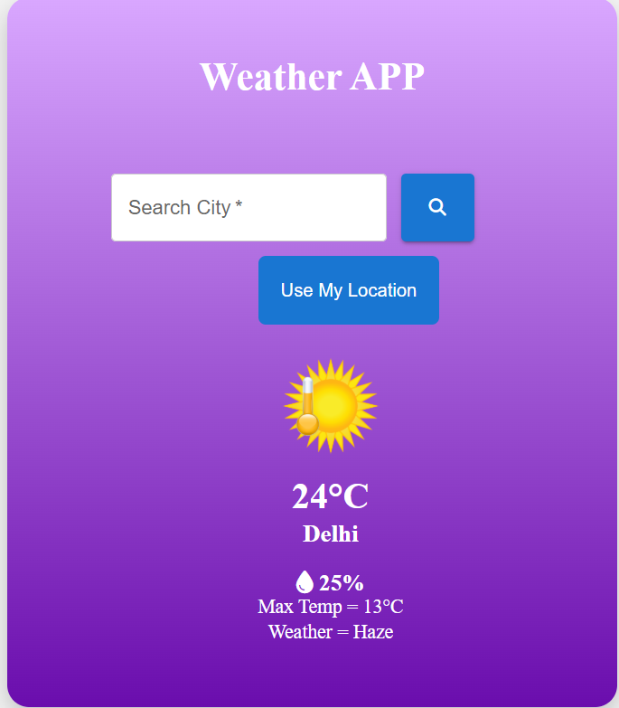

# 🌤️ Weather App

A modern React-based Weather Application that allows users to search weather conditions of any city and also fetch weather based on their current location using Geolocation API.

---

## 🚀 Features

- 🔍 Search weather by city name
- 📍 Get weather using current location
- 🌡️ Real-time temperature updates
- 🌥️ Displays weather conditions (Cloudy, Sunny, Rainy, etc.)
- 💨 Shows humidity and wind speed
- ⚡ Fast and responsive UI
- 🌎 Uses live weather API

---

## 🛠️ Tech Stack

- React.js
- JavaScript (ES6+)
- CSS
- OpenWeather API (or any weather API you used)
- Geolocation API

---

## 📂 Project Structure

```text
WEATHER-APP/
│
├── src/
│   ├── components/
│   │   ├── Weather.jsx
│   │   ├── Search.jsx
│   │   └── Location.jsx
│   │
│   ├── App.jsx
│   ├── index.js
│   └── styles.css
│
├── public/
├── package.json
└── README.md
```

---
## 🚀 Live Demo

🔗 https://weather-app-seven-flax-68.vercel.app/

## 📸 Screenshots

### Weather UI



---

## ⚙️ How It Works

- User enters city name OR allows location access
- App fetches data from weather API
- React state updates UI instantly
- Geolocation API gets latitude & longitude for current weather

---

## 🚀 Future Improvements

- 7-day weather forecast
- Hourly weather updates
- Dark/Light mode toggle
- Save favorite cities
- Weather animations

---

## 👨‍💻 Author

Ankit Kumar  
GitHub: https://github.com/ankiiitkumar01-lab